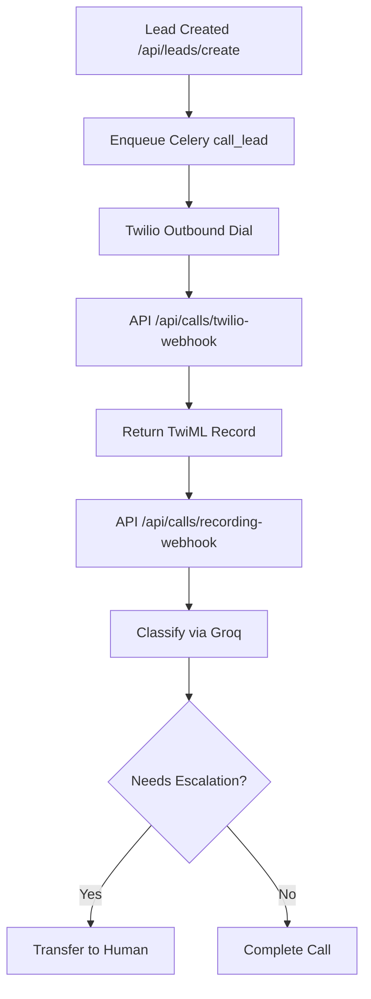
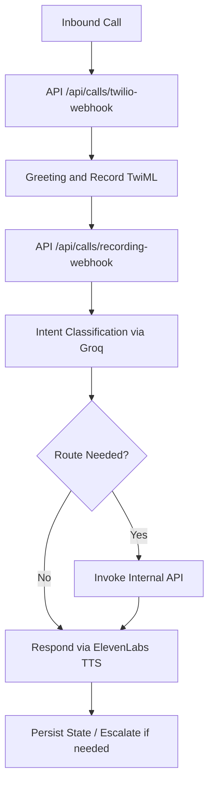
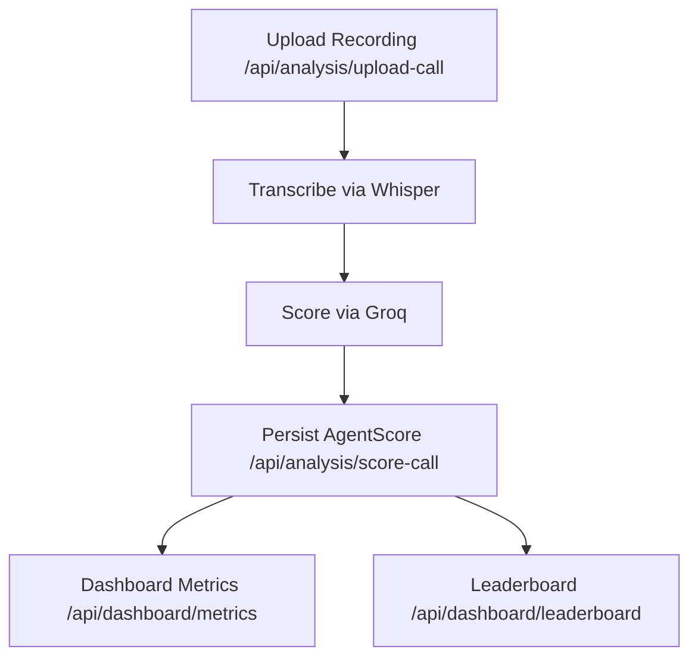

# Architecture & Flows

## Modules
- `app/core/config.py`: Environment, API keys, defaults, limits.
- `app/core/db.py`: SQLAlchemy engine, session, Base, dependency.
- `app/core/security.py`: Header-based role guard.
- `app/models/models.py`: Users, Leads, Calls, CallMessages, AgentScores, Escalations.
- `app/schemas/*`: Pydantic validation for requests and LLM outputs.
- `app/routers/*`: FastAPI routers for Leads, Calls, Analysis, Dashboard.
- `app/services/*`: Integrations (Groq, ElevenLabs, Whisper, Twilio, S3, Redis memory).
- `app/tasks/*`: Celery app and tasks for outbound call and scoring.
- `app/utils/llm.py`: LLM wrapper used by `/llm` demo route.
- `main.py`: App entrypoint; mounts routers and initializes DB.

## Data Model
- Users: admin, agent, supervisor roles.
- Leads: status lifecycle and optional score.
- Calls: inbound/outbound, Twilio SID, recording, transcript, summary, sentiment, escalation, duration.
- CallMessages: stream of messages per call (agent/customer/ai).
- AgentScores: detailed scores and feedback per call.
- Escalations: routing to human with reason and resolution.

## Outbound Flow
1. Lead created via `/api/leads/create` → enqueue Celery `call_lead`.
2. Worker calls Twilio API (stubbed) to initiate call to lead.
3. Twilio webhook `/api/calls/twilio-webhook` registers call and responds with TwiML to record.
4. Recording webhook `/api/calls/recording-webhook` stores RecordingUrl, runs Groq classification, sets `escalation_flag`.
5. If escalation needed → extend to call `Dial` or transfer to a human.

## Inbound Flow
1. Twilio receives inbound call → webhook `/api/calls/twilio-webhook`.
2. Respond with TwiML greeting + `Record`.
3. On `/recording-webhook`, persist URL, classify intent via Groq, optionally escalate.
4. For advanced routing: invoke internal APIs based on intent and respond via ElevenLabs TTS.

## Scoring Pipeline
1. Call recording uploaded to S3 via `/api/analysis/upload-call`.
2. Whisper transcribes audio to text (stubbed).
3. Groq scoring prompt evaluates greeting, empathy, objections, closing, script adherence.
4. Persist results to `agent_scores` via `/api/analysis/score-call`.
5. Dashboard aggregates metrics and leaderboard.

## Memory & Context
- Redis list per conversation id (`conv:{id}`) storing last 10 exchanges.
- Used in webhooks and can be fed into prompts for continuity.

## Security & Guardrails
- Pydantic schemas validate statuses and scoring ranges.
- Role guard on dashboard routes via `X-Role` header.
- Centralized token limit via `settings.max_llm_tokens`.
- Extend with JWT auth, audit logging, and content filters.

## Deployment
- Docker services: app, celery worker, postgres, redis, whisper_service, nginx.
- `Dockerfile` runs `uvicorn main:app`.
- Configure `.env` with keys and URLs; Postgres via compose or local SQLite fallback.

## Routes
- Leads
  - POST `/api/leads/create`
  - GET `/api/leads/{lead_id}`
  - PUT `/api/leads/update-status`
- Calls
  - POST `/api/calls/initiate-outbound-call`
  - POST `/api/calls/twilio-webhook`
  - POST `/api/calls/recording-webhook`
  - GET `/api/calls/{call_id}`
- Analysis
  - POST `/api/analysis/upload-call`
  - POST `/api/analysis/score-call`
  - GET `/api/analysis/agent/{agent_id}/report`
- Dashboard (protected)
  - GET `/api/dashboard/metrics`
  - GET `/api/dashboard/leaderboard`

## Code-to-Flow Mapping
- Lead creation → `app/routers/leads.py` + `app/tasks/outbound.py`
- Twilio voice lifecycle → `app/routers/calls.py`
- Scoring → `app/routers/analysis.py` + `app/services/groq.py`
- Metrics/leaderboard → `app/routers/dashboard.py`
- Memory → `app/services/memory.py`

## Flow Charts

### Outbound Call Flow

### Inbound Call Flow

### Scoring & Dashboard

